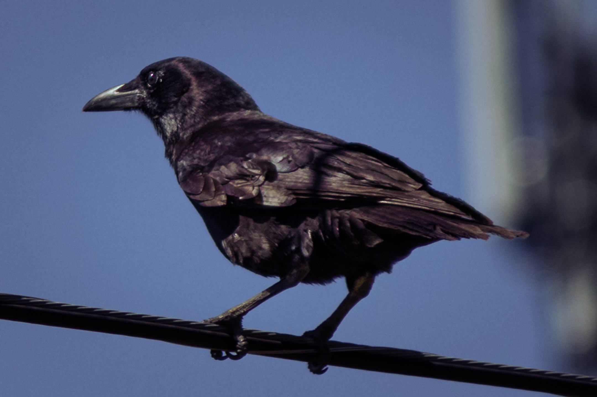
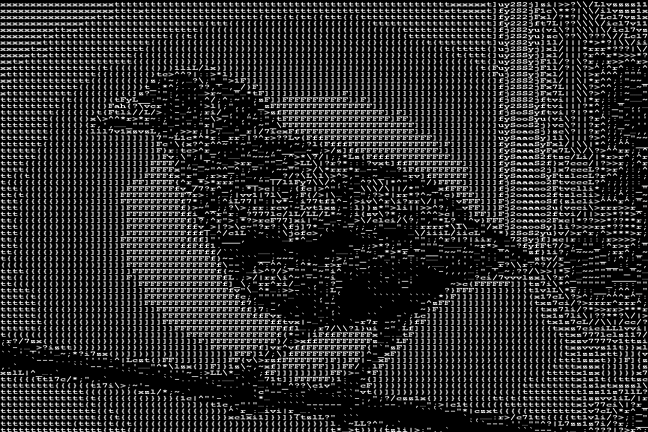
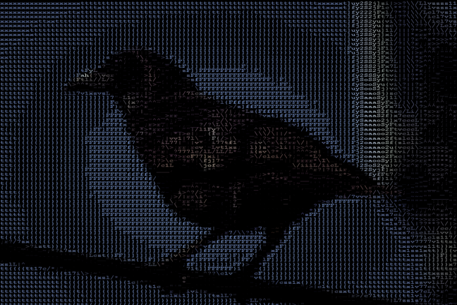

# Primitive ASCII Art Generator
 Generates "primitive" ASCII art. In this case "primitive" means value-based per pixel rather than line- or shape-based.
 
 ---
 ## Statement of Intent
 The idea behind the program is to have a class (`Picture`) that handles all the logic that one could need to handle converting any given picture into both or either a string that can be copied onto the clipboard and/or a .png to share with family, friends or the internet.
 
 My goals for this project are:
 
 - [x] Easy to use
 - [x] Minimal boilerplate for end user (might be the same thing as "easy to use")
 - [x] Makes reasonably-sized .pngs
 - [x] and, most importantly, done.
 
---
## Examples
Note: The original image may be destructively resized so until I can make it where that doesn't happen always use a backup copy of your image.

### Original

### ASCII approximation

### Colored ASCII (beta)

### Raw ASCII string
See the file [example_ascii_nickel.txt](Examples/example_ascii_nickel.txt) (for this example the original picture has been resized to be two hundred pixels wide)
